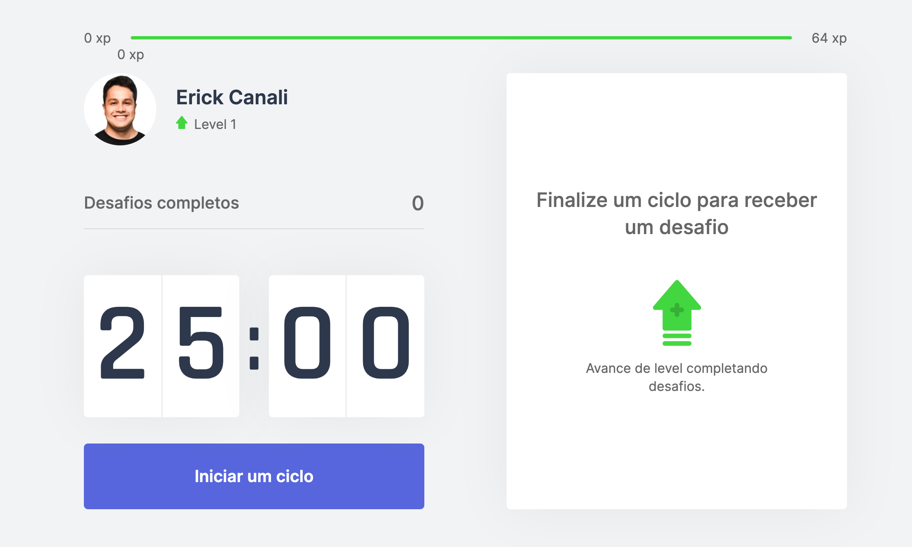

<p align="center">
   
</p>

<b>MoveIt</b> é um projeto front-end criado utilizando ReactJS, NextJS e TypeScript durante a NLW#4 da [Rocketseat](https://github.com/Rocketseat). Esse projeto consiste em te tirar da sua vida sedentária durante suas várias horas trabalhando sentado.

# :pushpin: Conteúdo

- [Demo](#eyes-demo)
- [Tecnologias](#computer-tecnologias)
- [Executando](#construction_worker-executando)

### Foto

<div>
   
</div>

# :eyes: Demo

👉 Demo: <https://moveit-ecanali.vercel.app/>

# :computer: Tecnologias

Este projeto foi feito utilizando as seguintes tecnologias:

- [NextJS](https://github.com/vercel/next.js/)
- [React](https://reactjs.org/)
- [TypeScript](https://www.typescriptlang.org/)

# :construction_worker: Executando

```bash
# Clone o Repositório
$ git clone https://github.com/ecanali/moveit.git
```

```bash
# Acesse a pasta do projeto e baixe as dependências
$ yarn
```

```bash
# Execute
$ yarn dev
```

Acesse <http://localhost:3000> para ver o resultado.
